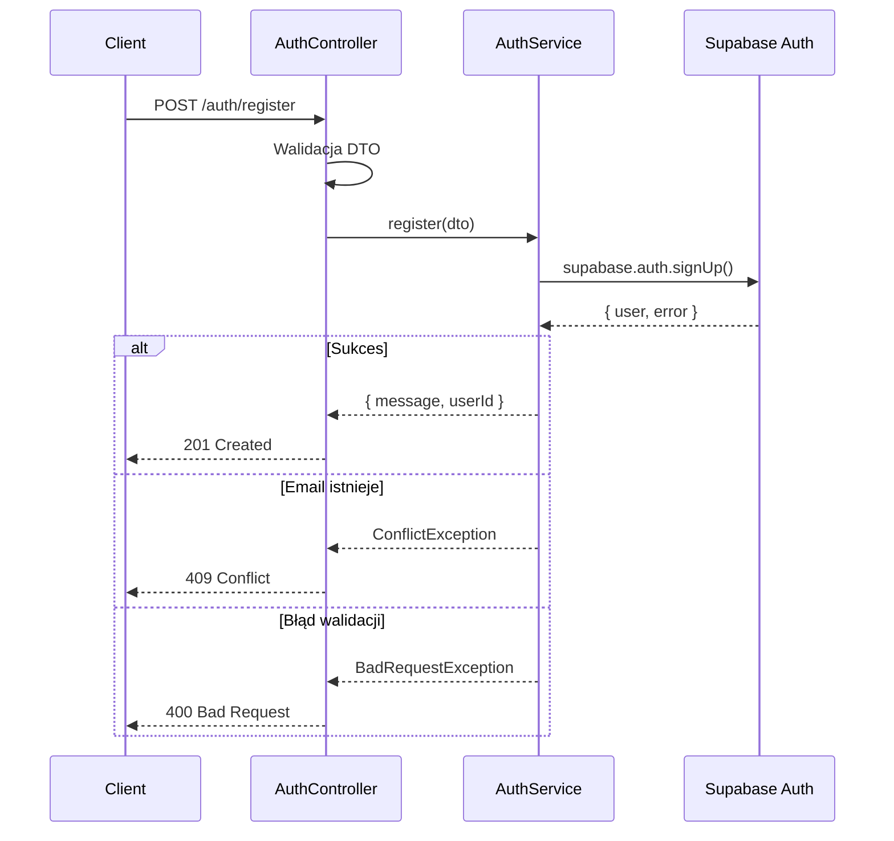
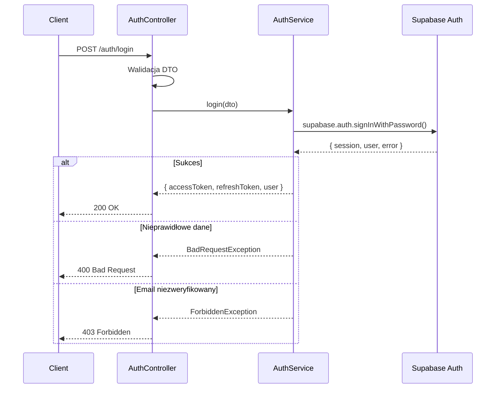
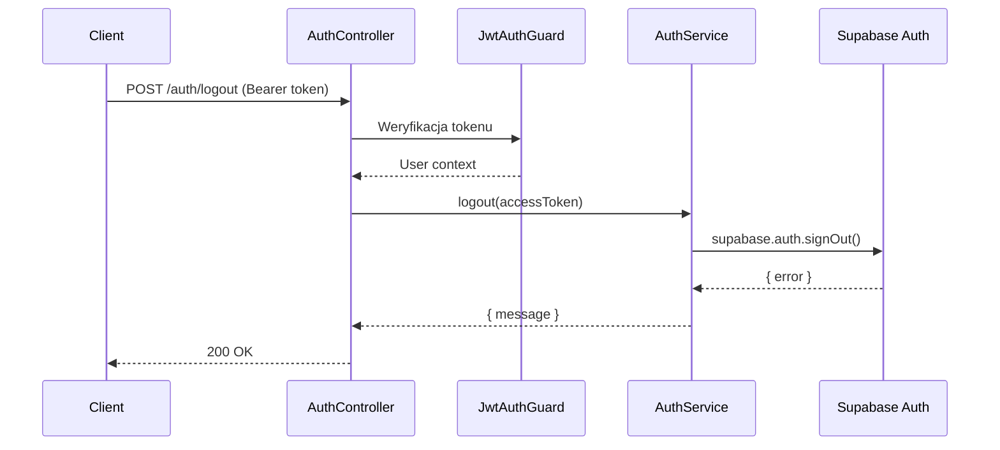
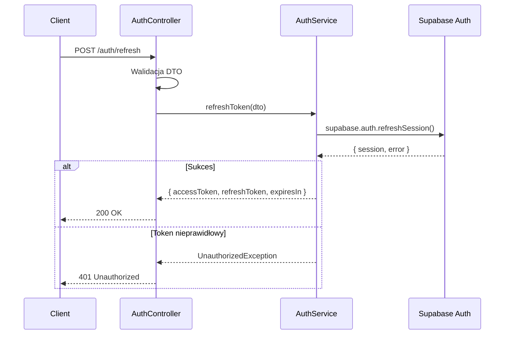

# API Endpoint Implementation Plan: Authentication Endpoints

## 1. Przegląd punktów końcowych

Moduł autentykacji obsługuje pełny cykl życia uwierzytelniania użytkownika w aplikacji Fakturologia. Wszystkie endpointy wykorzystują Supabase Auth jako backend uwierzytelniania, z NestJS jako warstwą pośredniczącą zapewniającą walidację, transformację danych i spójne API.

### Endpointy:

| Endpoint        | Metoda | Ścieżka                        | Opis                              |
| --------------- | ------ | ------------------------------ | --------------------------------- |
| Register        | POST   | `/api/v1/auth/register`        | Rejestracja nowego użytkownika    |
| Login           | POST   | `/api/v1/auth/login`           | Logowanie i wydanie tokenów       |
| Logout          | POST   | `/api/v1/auth/logout`          | Wylogowanie i unieważnienie sesji |
| Refresh         | POST   | `/api/v1/auth/refresh`         | Odświeżenie tokenu dostępu        |
| Forgot Password | POST   | `/api/v1/auth/forgot-password` | Żądanie resetu hasła              |
| Reset Password  | POST   | `/api/v1/auth/reset-password`  | Wykonanie resetu hasła            |

---

## 2. Szczegóły żądań

### 2.1 Register User

- **Metoda HTTP:** POST
- **URL:** `/api/v1/auth/register`
- **Autentykacja:** Brak (publiczny)
- **Request Body:**

```json
{
  "email": "user@example.com",
  "password": "securePassword123"
}
```

**Parametry:**

| Parametr | Typ    | Wymagany | Walidacja                                     |
| -------- | ------ | -------- | --------------------------------------------- |
| email    | string | Tak      | Format email, transformacja: lowercase + trim |
| password | string | Tak      | Min 8 znaków                                  |

---

### 2.2 Login User

- **Metoda HTTP:** POST
- **URL:** `/api/v1/auth/login`
- **Autentykacja:** Brak (publiczny)
- **Request Body:**

```json
{
  "email": "user@example.com",
  "password": "securePassword123"
}
```

**Parametry:**

| Parametr | Typ    | Wymagany | Walidacja                                     |
| -------- | ------ | -------- | --------------------------------------------- |
| email    | string | Tak      | Format email, transformacja: lowercase + trim |
| password | string | Tak      | Niepusty string                               |

---

### 2.3 Logout User

- **Metoda HTTP:** POST
- **URL:** `/api/v1/auth/logout`
- **Autentykacja:** Bearer JWT (wymagany)
- **Headers:**

```
Authorization: Bearer <accessToken>
```

- **Request Body:** Brak

---

### 2.4 Refresh Token

- **Metoda HTTP:** POST
- **URL:** `/api/v1/auth/refresh`
- **Autentykacja:** Brak (publiczny)
- **Request Body:**

```json
{
  "refreshToken": "eyJhbGciOiJIUzI1NiIs..."
}
```

**Parametry:**

| Parametr     | Typ    | Wymagany | Walidacja       |
| ------------ | ------ | -------- | --------------- |
| refreshToken | string | Tak      | Niepusty string |

---

### 2.5 Forgot Password

- **Metoda HTTP:** POST
- **URL:** `/api/v1/auth/forgot-password`
- **Autentykacja:** Brak (publiczny)
- **Request Body:**

```json
{
  "email": "user@example.com"
}
```

**Parametry:**

| Parametr | Typ    | Wymagany | Walidacja    |
| -------- | ------ | -------- | ------------ |
| email    | string | Tak      | Format email |

---

### 2.6 Reset Password

- **Metoda HTTP:** POST
- **URL:** `/api/v1/auth/reset-password`
- **Autentykacja:** Brak (publiczny)
- **Request Body:**

```json
{
  "token": "reset-token-from-email",
  "password": "newSecurePassword123"
}
```

**Parametry:**

| Parametr | Typ    | Wymagany | Walidacja       |
| -------- | ------ | -------- | --------------- |
| token    | string | Tak      | Niepusty string |
| password | string | Tak      | Min 8 znaków    |

---

## 3. Wykorzystywane typy

### 3.1 Request DTOs

```typescript
// src/modules/auth/dto/register.dto.ts
export class RegisterDto {
  @ApiProperty({ example: "user@example.com" })
  @IsEmail({}, { message: "Podaj prawidłowy adres email" })
  @Transform(({ value }) => value.toLowerCase().trim())
  email: string;

  @ApiProperty({ minLength: 8 })
  @IsString()
  @MinLength(8, { message: "Hasło musi mieć minimum 8 znaków" })
  password: string;
}

// src/modules/auth/dto/login.dto.ts
export class LoginDto {
  @ApiProperty({ example: "user@example.com" })
  @IsEmail({}, { message: "Podaj prawidłowy adres email" })
  @Transform(({ value }) => value.toLowerCase().trim())
  email: string;

  @ApiProperty()
  @IsString()
  @IsNotEmpty({ message: "Hasło jest wymagane" })
  password: string;
}

// src/modules/auth/dto/refresh-token.dto.ts
export class RefreshTokenDto {
  @ApiProperty()
  @IsString()
  @IsNotEmpty({ message: "Refresh token jest wymagany" })
  refreshToken: string;
}

// src/modules/auth/dto/forgot-password.dto.ts
export class ForgotPasswordDto {
  @ApiProperty({ example: "user@example.com" })
  @IsEmail({}, { message: "Podaj prawidłowy adres email" })
  @Transform(({ value }) => value.toLowerCase().trim())
  email: string;
}

// src/modules/auth/dto/reset-password.dto.ts
export class ResetPasswordDto {
  @ApiProperty()
  @IsString()
  @IsNotEmpty({ message: "Token jest wymagany" })
  token: string;

  @ApiProperty({ minLength: 8 })
  @IsString()
  @MinLength(8, { message: "Hasło musi mieć minimum 8 znaków" })
  password: string;
}
```

### 3.2 Response DTOs

```typescript
// src/modules/auth/dto/responses/register-response.dto.ts
export class RegisterResponseDto {
  @ApiProperty()
  message: string;

  @ApiProperty({ format: "uuid" })
  userId: string;
}

// src/modules/auth/dto/responses/login-response.dto.ts
export class UserBasicDto {
  @ApiProperty({ format: "uuid" })
  id: string;

  @ApiProperty()
  email: string;
}

export class LoginResponseDto {
  @ApiProperty()
  accessToken: string;

  @ApiProperty()
  refreshToken: string;

  @ApiProperty({ example: 3600 })
  expiresIn: number;

  @ApiProperty({ type: UserBasicDto })
  user: UserBasicDto;
}

// src/modules/auth/dto/responses/refresh-response.dto.ts
export class RefreshResponseDto {
  @ApiProperty()
  accessToken: string;

  @ApiProperty()
  refreshToken: string;

  @ApiProperty({ example: 3600 })
  expiresIn: number;
}

// src/modules/auth/dto/responses/message-response.dto.ts
export class MessageResponseDto {
  @ApiProperty()
  message: string;
}
```

### 3.3 Error Codes Enum

```typescript
// src/modules/auth/enums/auth-error-codes.enum.ts
export enum AuthErrorCode {
  INVALID_EMAIL = "INVALID_EMAIL",
  WEAK_PASSWORD = "WEAK_PASSWORD",
  EMAIL_EXISTS = "EMAIL_EXISTS",
  INVALID_CREDENTIALS = "INVALID_CREDENTIALS",
  EMAIL_NOT_VERIFIED = "EMAIL_NOT_VERIFIED",
  ACCOUNT_LOCKED = "ACCOUNT_LOCKED",
  INVALID_REFRESH_TOKEN = "INVALID_REFRESH_TOKEN",
  INVALID_TOKEN = "INVALID_TOKEN",
}
```

---

## 4. Szczegóły odpowiedzi

### 4.1 Register User

**Sukces (201 Created):**

```json
{
  "message": "Registration successful. Please check your email to verify your account.",
  "userId": "uuid"
}
```

**Błędy:**

| Status | Kod           | Komunikat                              |
| ------ | ------------- | -------------------------------------- |
| 400    | INVALID_EMAIL | Invalid email format                   |
| 400    | WEAK_PASSWORD | Password must be at least 8 characters |
| 409    | EMAIL_EXISTS  | Email is already registered            |

---

### 4.2 Login User

**Sukces (200 OK):**

```json
{
  "accessToken": "eyJhbGciOiJIUzI1NiIs...",
  "refreshToken": "eyJhbGciOiJIUzI1NiIs...",
  "expiresIn": 3600,
  "user": {
    "id": "uuid",
    "email": "user@example.com"
  }
}
```

**Błędy:**

| Status | Kod                 | Komunikat                                                               |
| ------ | ------------------- | ----------------------------------------------------------------------- |
| 400    | INVALID_CREDENTIALS | Invalid email or password                                               |
| 403    | EMAIL_NOT_VERIFIED  | Please verify your email before logging in                              |
| 429    | ACCOUNT_LOCKED      | Account locked due to too many failed attempts. Try again in 15 minutes |

---

### 4.3 Logout User

**Sukces (200 OK):**

```json
{
  "message": "Successfully logged out"
}
```

**Błędy:**

| Status | Kod          | Komunikat                |
| ------ | ------------ | ------------------------ |
| 401    | UNAUTHORIZED | Invalid or missing token |

---

### 4.4 Refresh Token

**Sukces (200 OK):**

```json
{
  "accessToken": "eyJhbGciOiJIUzI1NiIs...",
  "refreshToken": "eyJhbGciOiJIUzI1NiIs...",
  "expiresIn": 3600
}
```

**Błędy:**

| Status | Kod                   | Komunikat                        |
| ------ | --------------------- | -------------------------------- |
| 401    | INVALID_REFRESH_TOKEN | Invalid or expired refresh token |

---

### 4.5 Forgot Password

**Sukces (200 OK):**

```json
{
  "message": "If the email exists, a password reset link has been sent"
}
```

> **Uwaga:** Zawsze zwraca 200 OK, aby zapobiec enumeracji adresów email.

---

### 4.6 Reset Password

**Sukces (200 OK):**

```json
{
  "message": "Password successfully reset"
}
```

**Błędy:**

| Status | Kod           | Komunikat                              |
| ------ | ------------- | -------------------------------------- |
| 400    | INVALID_TOKEN | Invalid or expired reset token         |
| 400    | WEAK_PASSWORD | Password must be at least 8 characters |

---

## 5. Przepływ danych

### 5.1 Architektura

```
┌──────────────┐     ┌──────────────────┐     ┌─────────────────┐
│   Frontend   │────▶│  AuthController  │────▶│   AuthService   │
│   (Angular)  │     │    (NestJS)      │     │    (NestJS)     │
└──────────────┘     └──────────────────┘     └────────┬────────┘
                                                       │
                                                       ▼
                                              ┌─────────────────┐
                                              │  Supabase Auth  │
                                              │  (PostgreSQL)   │
                                              └─────────────────┘
```

### 5.2 Przepływ rejestracji



### 5.3 Przepływ logowania



### 5.4 Przepływ wylogowania



### 5.5 Przepływ odświeżania tokenu



---

## 6. Względy bezpieczeństwa

### 6.1 Ochrona przed atakami

| Zagrożenie        | Mitygacja                                              |
| ----------------- | ------------------------------------------------------ |
| Brute Force       | Rate limiting (100 req/15min na IP)                    |
| Email Enumeration | Stała odpowiedź dla forgot-password                    |
| Token Theft       | Krótki TTL access token (15min), rotacja refresh token |
| XSS               | HttpOnly cookies (opcjonalnie), sanityzacja            |
| CSRF              | SameSite cookies, CORS origin validation               |
| SQL Injection     | Supabase SDK (parametryzowane zapytania)               |

### 6.2 Konfiguracja bezpieczeństwa

```typescript
// main.ts - Konfiguracja zabezpieczeń
app.use(helmet());
app.enableCors({
  origin: process.env.ALLOWED_ORIGINS?.split(",") || [],
  credentials: true,
});
app.use(
  rateLimit({
    windowMs: 15 * 60 * 1000, // 15 minut
    max: 100, // max 100 żądań na IP
  })
);
```

### 6.3 Walidacja danych

```typescript
app.useGlobalPipes(
  new ValidationPipe({
    whitelist: true, // Usuń nieznane pola
    forbidNonWhitelisted: true, // Błąd przy nieznanych polach
    transform: true, // Automatyczna transformacja typów
  })
);
```

### 6.4 JWT Configuration

```typescript
// Supabase JWT settings (config.toml)
[auth];
jwt_expiry = 3600; // 1 godzina
enable_refresh_token_rotation = true;
refresh_token_reuse_interval = 10; // 10 sekund grace period
```

---

## 7. Obsługa błędów

### 7.1 Custom Auth Exceptions

```typescript
// src/modules/auth/exceptions/auth.exceptions.ts
import { HttpStatus } from "@nestjs/common";
import { DomainException } from "../../../common/exceptions/domain.exception";
import { AuthErrorCode } from "../enums/auth-error-codes.enum";

export class InvalidCredentialsException extends DomainException {
  constructor() {
    super(
      "Invalid email or password",
      AuthErrorCode.INVALID_CREDENTIALS,
      HttpStatus.BAD_REQUEST
    );
  }
}

export class EmailExistsException extends DomainException {
  constructor() {
    super(
      "Email is already registered",
      AuthErrorCode.EMAIL_EXISTS,
      HttpStatus.CONFLICT
    );
  }
}

export class EmailNotVerifiedException extends DomainException {
  constructor() {
    super(
      "Please verify your email before logging in",
      AuthErrorCode.EMAIL_NOT_VERIFIED,
      HttpStatus.FORBIDDEN
    );
  }
}

export class AccountLockedException extends DomainException {
  constructor() {
    super(
      "Account locked due to too many failed attempts. Try again in 15 minutes",
      AuthErrorCode.ACCOUNT_LOCKED,
      HttpStatus.TOO_MANY_REQUESTS
    );
  }
}

export class InvalidRefreshTokenException extends DomainException {
  constructor() {
    super(
      "Invalid or expired refresh token",
      AuthErrorCode.INVALID_REFRESH_TOKEN,
      HttpStatus.UNAUTHORIZED
    );
  }
}

export class InvalidResetTokenException extends DomainException {
  constructor() {
    super(
      "Invalid or expired reset token",
      AuthErrorCode.INVALID_TOKEN,
      HttpStatus.BAD_REQUEST
    );
  }
}
```

### 7.2 Mapowanie błędów Supabase

```typescript
// src/modules/auth/utils/supabase-error-mapper.ts
export function mapSupabaseAuthError(error: AuthError): never {
  switch (error.message) {
    case "User already registered":
      throw new EmailExistsException();
    case "Invalid login credentials":
      throw new InvalidCredentialsException();
    case "Email not confirmed":
      throw new EmailNotVerifiedException();
    case "Invalid Refresh Token":
    case "Refresh Token Not Found":
      throw new InvalidRefreshTokenException();
    default:
      throw new InternalServerErrorException("Authentication failed");
  }
}
```

### 7.3 Struktura odpowiedzi błędu

```json
{
  "statusCode": 400,
  "code": "INVALID_CREDENTIALS",
  "message": "Invalid email or password",
  "timestamp": "2026-01-02T12:00:00.000Z",
  "path": "/api/v1/auth/login"
}
```

---

## 8. Rozważania dotyczące wydajności

### 8.1 Optymalizacje

| Aspekt             | Strategia                                        |
| ------------------ | ------------------------------------------------ |
| Connection Pooling | Supabase zarządza pulą połączeń                  |
| Token Validation   | Cache publicznych kluczy JWT                     |
| Rate Limiting      | Redis dla distributed rate limiting (przyszłość) |
| Logging            | Async logging, nie blokujące                     |

### 8.2 Metryki do monitorowania

- Czas odpowiedzi endpointów auth
- Liczba nieudanych prób logowania
- Liczba rejestracji dziennie
- Liczba resetów hasła

---

## 9. Etapy wdrożenia

### Faza 1: Struktura modułu (Priorytet: Wysoki)

1. **Utworzenie struktury katalogów:**

   ```
   src/modules/auth/
   ├── dto/
   │   ├── register.dto.ts
   │   ├── login.dto.ts
   │   ├── refresh-token.dto.ts
   │   ├── forgot-password.dto.ts
   │   ├── reset-password.dto.ts
   │   └── responses/
   │       ├── register-response.dto.ts
   │       ├── login-response.dto.ts
   │       ├── refresh-response.dto.ts
   │       └── message-response.dto.ts
   ├── enums/
   │   └── auth-error-codes.enum.ts
   ├── exceptions/
   │   └── auth.exceptions.ts
   ├── guards/
   │   └── jwt-auth.guard.ts
   ├── strategies/
   │   └── jwt.strategy.ts
   ├── utils/
   │   └── supabase-error-mapper.ts
   ├── auth.controller.ts
   ├── auth.service.ts
   └── auth.module.ts
   ```

2. **Utworzenie DTOs z walidacją** (wszystkie pliki z sekcji 3.1 i 3.2)

3. **Utworzenie enum z kodami błędów** (sekcja 3.3)

### Faza 2: Serwis Supabase (Priorytet: Wysoki)

4. **Konfiguracja Supabase Client w NestJS:**

   ```typescript
   // src/common/supabase/supabase.module.ts
   @Module({
     providers: [
       {
         provide: "SUPABASE_CLIENT",
         useFactory: (configService: ConfigService) => {
           return createClient(
             configService.get("SUPABASE_URL"),
             configService.get("SUPABASE_SERVICE_KEY")
           );
         },
         inject: [ConfigService],
       },
     ],
     exports: ["SUPABASE_CLIENT"],
   })
   export class SupabaseModule {}
   ```

5. **Dodanie zmiennych środowiskowych:**
   ```env
   SUPABASE_URL=https://your-project.supabase.co
   SUPABASE_ANON_KEY=your-anon-key
   SUPABASE_SERVICE_KEY=your-service-key
   JWT_SECRET=your-jwt-secret
   ```

### Faza 3: AuthService (Priorytet: Wysoki)

6. **Implementacja AuthService:**

   - `register(dto: RegisterDto): Promise<RegisterResponseDto>`
   - `login(dto: LoginDto): Promise<LoginResponseDto>`
   - `logout(accessToken: string): Promise<MessageResponseDto>`
   - `refreshToken(dto: RefreshTokenDto): Promise<RefreshResponseDto>`
   - `forgotPassword(dto: ForgotPasswordDto): Promise<MessageResponseDto>`
   - `resetPassword(dto: ResetPasswordDto): Promise<MessageResponseDto>`

7. **Implementacja mapowania błędów Supabase** (sekcja 7.2)

### Faza 4: AuthController (Priorytet: Wysoki)

8. **Implementacja AuthController:**

   ```typescript
   @ApiTags("Auth")
   @Controller("auth")
   export class AuthController {
     constructor(private readonly authService: AuthService) {}

     @Post("register")
     @HttpCode(HttpStatus.CREATED)
     @ApiOperation({ summary: "Rejestracja nowego użytkownika" })
     @ApiResponse({ status: 201, type: RegisterResponseDto })
     async register(@Body() dto: RegisterDto): Promise<RegisterResponseDto> {
       return this.authService.register(dto);
     }

     // ... pozostałe endpointy
   }
   ```

### Faza 5: Guards i Strategy (Priorytet: Wysoki)

9. **Implementacja JwtStrategy:**

   - Konfiguracja Passport z Supabase JWT
   - Walidacja tokenu i ekstrakcja użytkownika

10. **Implementacja JwtAuthGuard:**
    - Obsługa błędów autoryzacji
    - Wsparcie dla dekoratora @Public()

### Faza 6: Integracja (Priorytet: Średni)

11. **Utworzenie AuthModule:**

    ```typescript
    @Module({
      imports: [
        SupabaseModule,
        PassportModule.register({ defaultStrategy: "jwt" }),
      ],
      controllers: [AuthController],
      providers: [AuthService, JwtStrategy],
      exports: [AuthService],
    })
    export class AuthModule {}
    ```

12. **Rejestracja w AppModule**

13. **Konfiguracja globalnych guards i filters w main.ts**

### Faza 7: Testowanie (Priorytet: Wysoki)

14. **Testy jednostkowe AuthService:**

    - Test każdej metody z mockami Supabase
    - Test scenariuszy błędów

15. **Testy E2E:**
    - Pełny flow rejestracji
    - Pełny flow logowania
    - Pełny flow resetu hasła
    - Test rate limitingu

### Faza 8: Dokumentacja (Priorytet: Średni)

16. **Swagger dokumentacja:**

    - Wszystkie endpointy z przykładami
    - Wszystkie możliwe odpowiedzi błędów
    - Schema dla DTOs

17. **README z instrukcją konfiguracji**

---

## 10. Checklist przed wdrożeniem

- [ ] Wszystkie DTOs zaimplementowane z walidacją
- [ ] AuthService z pełną obsługą błędów Supabase
- [ ] AuthController z dokumentacją Swagger
- [ ] JwtAuthGuard działa poprawnie
- [ ] Rate limiting skonfigurowany
- [ ] Zmienne środowiskowe w .env.example
- [ ] Testy jednostkowe (pokrycie > 80%)
- [ ] Testy E2E dla krytycznych ścieżek
- [ ] Logging dla operacji auth
- [ ] CORS skonfigurowany poprawnie
- [ ] Helmet włączony
- [ ] Brak hardkodowanych sekretów
